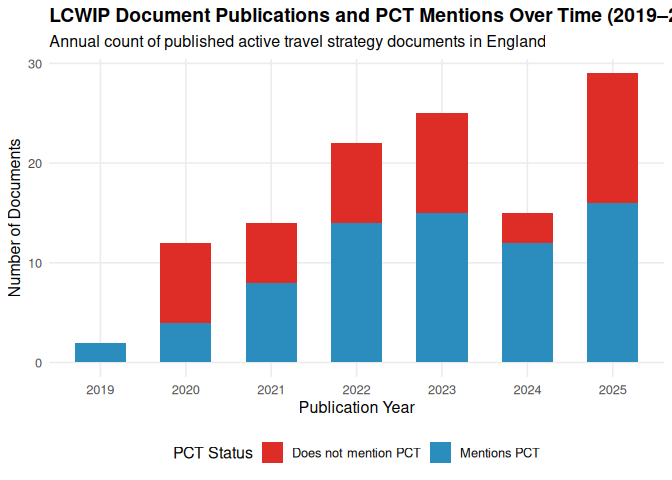

# PCT / LCWIP Data Ingest 2026 — Exploratory Analysis

2026-08-17

- [<span class="toc-section-number">1</span> Overview](#overview)
- [<span class="toc-section-number">2</span> Methods](#methods)
- [<span class="toc-section-number">3</span> Corpus
  composition](#corpus-composition)
- [<span class="toc-section-number">4</span> PCT
  mentions](#pct-mentions)
  - [<span class="toc-section-number">4.1</span> PCT mentions by
    document type](#pct-mentions-by-document-type)
  - [<span class="toc-section-number">4.2</span> Change over
    time](#change-over-time)
- [<span class="toc-section-number">5</span> Scenario
  usage](#scenario-usage)
- [<span class="toc-section-number">6</span> Geographic
  coverage](#geographic-coverage)
- [<span class="toc-section-number">7</span> Cost and network
  length](#cost-and-network-length)
- [<span class="toc-section-number">8</span> Illustrative
  examples](#illustrative-examples)
- [<span class="toc-section-number">9</span> Limitations & next
  steps](#limitations--next-steps)

# Overview

This document reports the results of the **2026 re-run** of the
data-ingest process that collects evidence of the Propensity to Cycle
Tool (PCT) and related active-travel planning tools in English Local
Cycling and Walking Infrastructure Plans (LCWIPs) and related documents.

The 2026 run is a **proof-of-concept for England** (the first stage
before an international roll-out). It improves on the previous (~2024)
work in three ways:

1.  **Distinction between LCWIP reports and related material** — each
    document is classified `LCWIP`, `LCWIP-related`, or `other`, a
    distinction the previous work did not make.
2.  **Richer “how PCT was used” detail** — explicit scenario usage
    (`Go Dutch`, `Government Target`, `E-bike`, `Go Cambridge`), data
    sources, desire-line usage and prioritisation-integration flags.
3.  **Reproducible pipeline** — every web page / PDF is downloaded to
    `data-govuk-2026-raw` and a `.md` text extract written to
    `data-govuk-2026-md`; structured fields are extracted with a single,
    unlimited local engine (Ollama `gemma4-12b-hermes`) so the results
    are fully reproducible without paid API credits.

The headline dataset merges the fresh 2026 collection with the existing
94-entry database (`LCWIP_database.json`), so the release shows **how
the evidence base has grown**.

# Methods

- **Discovery.** Seed URLs came from the existing 94-entry database,
  supplemented by web searches for 2024–2026 LCWIPs and related
  active-travel strategies, plus the Transport for the South East (TfSE)
  Regional Active Travel Strategy and Action Plan (RATSAP) Evidence Base
  (June 2025), which contains a 64-LCWIP status log for the South East.
- **Download.** Each candidate URL was fetched and stored as a raw file
  (`data-govuk-2026-raw`) with a text/markdown extract
  (`data-govuk-2026-md`).
- **Extraction.** A 21-field schema (`schema_2026.json`) was applied per
  document via a local LLM. Outputs are in `results/extracted/`.
- **Aggregation.** Extracted records were merged with the 94-entry
  database by URL/name and written to `results.json` and a flat
  `results.csv`.

# Corpus composition

``` python
import pandas as pd
df = pd.read_csv("results/results_flat.csv")
print(f"Total merged records: {len(df)}")
```

    Total merged records: 232

``` python
print(f"  2026-only: {(df['_source_tag']=='2026').sum()}")
```

      2026-only: 228

``` python
print(f"  from existing 94-DB: {(df['_source_tag']=='existing94').sum()}")
```

      from existing 94-DB: 4

``` python
print()
```

``` python
print("Document type:")
```

    Document type:

``` python
print(df['doc_type'].fillna('(unknown)').value_counts())
```

    doc_type
    LCWIP            196
    other             23
    LCWIP-related     10
    (unknown)          3
    Name: count, dtype: int64

# PCT mentions

The central finding for the REF case study is the share of documents
that explicitly mention the Propensity to Cycle Tool.

``` python
import pandas as pd
df = pd.read_csv("results/results_flat.csv")
pct = df['mentions_pct']
n = pct.notna().sum()
mentioned = (pct == True).sum()
print(f"Documents with a usable mentions_pct flag: {n}")
```

    Documents with a usable mentions_pct flag: 228

``` python
print(f"Mention PCT: {mentioned} ({mentioned/n*100:.1f}%)")
```

    Mention PCT: 148 (64.9%)

``` python
print(f"Do not mention PCT: {(pct==False).sum()} ({ (pct==False).sum()/n*100:.1f}%)")
```

    Do not mention PCT: 80 (35.1%)

``` python
print(f"Unknown (no content / failed download): {pct.isna().sum()}")
```

    Unknown (no content / failed download): 4

## PCT mentions by document type

``` python
import pandas as pd
df = pd.read_csv("results/results_flat.csv")
ct = pd.crosstab(df['doc_type'].fillna('unknown'), df['mentions_pct'].fillna('unknown'))
print(ct)
```

    mentions_pct   False  True  unknown
    doc_type                           
    LCWIP             56   136        4
    LCWIP-related      5     5        0
    other             17     6        0
    unknown            2     1        0

## Change over time

The chart below shows the evolution of LCWIP and active travel document
publications over time (2019–2025), categorized by whether the report
mentions the Propensity to Cycle Tool.

``` r
library(readr)
library(ggplot2)
library(dplyr)

df <- read_csv("results/results_flat.csv", show_col_types = FALSE) %>%
  mutate(year = readr::parse_number(as.character(date_published))) %>%
  filter(!is.na(year), year >= 2018, year <= 2026)


df_summary <- df %>%
  mutate(pct_label = if_else(mentions_pct, "Mentions PCT", "Does not mention PCT")) %>%
  group_by(year = factor(year), pct_label) %>%
  summarise(count = n(), .groups = "drop")

ggplot(df_summary, aes(x = year, y = count, fill = pct_label)) +
  geom_col(position = "stack", width = 0.6) +
  scale_fill_manual(values = c("Mentions PCT" = "#2b8cbe", "Does not mention PCT" = "#de2d26")) +
  labs(
    title = "LCWIP Document Publications and PCT Mentions Over Time (2019–2025)",
    subtitle = "Annual count of published active travel strategy documents in England",
    x = "Publication Year",
    y = "Number of Documents",
    fill = "PCT Status"
  ) +
  theme_minimal(base_size = 12) +
  theme(
    legend.position = "bottom",
    plot.title = element_text(face = "bold"),
    panel.grid.minor = element_blank()
  )
```

<div id="fig-pct-over-time">



Figure 1: Publication of LCWIP and active-travel planning documents over
time by PCT mention status.

</div>

# Scenario usage

Among documents that mention the PCT, which future scenarios are
referenced?

``` python
import json, pandas as pd
from collections import Counter
df = pd.read_csv("results/results_flat.csv")
c = Counter()
for _, r in df.iterrows():
    if r.get('mentions_pct') is True or r.get('mentions_pct') == True:
        scs = r.get('pct_scenarios_used')
        if pd.notna(scs):
            if isinstance(scs, str):
                try: scs = json.loads(scs)
                except: pass
            if isinstance(scs, list):
                for s in scs:
                    c[str(s).strip()] += 1
sc = pd.Series(dict(c)).sort_values(ascending=False)
print("Scenario mentions (across PCT-mentioning docs):")
```

    Scenario mentions (across PCT-mentioning docs):

``` python
print(sc.to_string())
```

    Go Dutch             79
    Government Target    62
    E-bike               35
    Baseline             24
    Go Cambridge          4
    Gender Equality       1

# Geographic coverage

Coverage against the higher-tier authorities in
[uktransportauthorities](https://github.com/itsleeds/uktransportauthorities)
(ATF allocations) gives a sense of how much of England is represented.

``` python
import pandas as pd
df = pd.read_csv("results/results_flat.csv")
print("Records by region (England):")
```

    Records by region (England):

``` python
print(df['region'].fillna('(not stated)').value_counts().to_string())
```

    region
    South East                  51
    South West                  34
    (not stated)                21
    East of England             18
    North West                  18
    West Midlands               16
    Yorkshire and the Humber    14
    North West England          10
    East Midlands               10
    North East                   9
    South East England           8
    West Yorkshire               7
    Hertfordshire                3
    Surrey                       2
    West of England              2
    Northwest England            2
    D2N2                         2
    East                         2
    Kent                         1
    South West England           1
    South Yorkshire              1

``` python
print()
```

``` python
print("Records with a combined authority named:")
```

    Records with a combined authority named:

``` python
print(df['combined_authority_name'].notna().sum())
```

    43

# Cost and network length

Where stated, LCWIPs propose substantial networks and investment.

``` python
import pandas as pd
df = pd.read_csv("results/results_flat.csv")
cost = pd.to_numeric(df['total_cost_pounds'], errors='coerce')
km = pd.to_numeric(df['length_of_network_km'], errors='coerce')
print(f"Documents stating a total cost: {cost.notna().sum()}")
```

    Documents stating a total cost: 46

``` python
print(f"Total stated investment (£): {cost.sum():,.0f}")
```

    Total stated investment (£): 23,596,927,576

``` python
print(f"Median stated investment (£): {cost.median():,.0f}")
```

    Median stated investment (£): 53,000,000

``` python
print(f"Documents stating network length (km): {km.notna().sum()}")
```

    Documents stating network length (km): 33

``` python
print(f"Total stated network length (km): {km.sum():,.0f}")
```

    Total stated network length (km): 12,304

# Illustrative examples

A sample of LCWIPs that mention the PCT, with how it was used:

``` python
import pandas as pd
df = pd.read_csv("results/results_flat.csv")
ex = df[(df['mentions_pct']==True) & (df['doc_type']=='LCWIP')].head(10)
for _, r in ex.iterrows():
    print(f"### {r.get('report_name')} ({r.get('local_authority_name')})")
    print(f"- Date: {r.get('date_published')}")
    print(f"- Scenarios: {r.get('pct_scenarios_used')}")
    print(f"- How used: {str(r.get('how_pct_was_used') or '')[:300]}")
    print()
```

    ### Local Cycling and Walking Infrastructure Plan (LCWIP) (Liverpool City Region Combined Authority (LCRCA), in partnership with Halton, Knowsley, Liverpool, Sefton, St Helens, and Wirral councils.[1])
    - Date: 2023-09
    - Scenarios: ["Government Target", "Go Dutch"]
    - How used: The PCT was used to identify potential for cycling growth, analyze existing low-cycling areas with high potential, and compare scenarios to demonstrate the impact of full implementation of the Government’s Cycling and Walking Investment Strategy (CWIS) in the LCR.

    ### Warwickshire Local Cycling and Walking Infrastructure Plan (Warwickshire County Council)
    - Date: February 2024
    - Scenarios: nan
    - How used: nan

    ### Banbury Local Cycling and Walking Infrastructure Plan (LCWIP) (Oxfordshire County Council)
    - Date: July 2023
    - Scenarios: ["Baseline", "Go Dutch", "E-bike"]
    - How used: The PCT was used to estimate cycling potential, identify existing and future cycling demand, and inform the prioritisation of the cycle network by highlighting routes with the largest numbers of potential cyclists.

    ### Local Cycling and Walking Infrastructure Plan – (LCWIP) (Brentwood)
    - Date: 2025
    - Scenarios: nan
    - How used: Referenced in Appendix D (WSP Technical Report) as a primary data source under Stage 2 (Gathering Information) and contrasted against WSPs custom GIS network model which evaluates destinations beyond PCT commute and school trips.

    ### Cambridgeshire’s Local Cycling and Walking Infrastructure Plan (Cambridgeshire County Council)
    - Date: 2022
    - Scenarios: nan
    - How used: The tool was used to establish the propensity to cycle based on trip distance, identifying that the peak distance for cycling is 2km, with the majority of trips between 1km and 5km. It helped analyze the cycling distance for mapped trips from the 2011 Census data.

    ### Crawley Local Cycling and Walking Infrastructure Plan (Crawley Borough Council)
    - Date: July 2023
    - Scenarios: ["Government Target", "Go Dutch"]
    - How used: The PCT was used to identify likely route corridors for cycling to work or school, compare them with manually mapped desire lines, and generate estimates of potential cycle rates based on policy targets.

    ### Carlisle Local Cycling and Walking Infrastructure Plan (LCWIP) 2022 - 2037 (Cumbria County Council)
    - Date: March 2022
    - Scenarios: nan
    - How used: The Propensity to Cycle Tool (PCT) was used as a data source to identify the most popular cycle routes for school and travel-to-work journeys within the district.

    ### Workington Local Cycling and Walking Infrastructure Plan (LCWIP) 2022 - 2037 (Cumbria County Council)
    - Date: June 2022
    - Scenarios: nan
    - How used: The Propensity to Cycle Tool (PCT) was used as a data source to identify the most popular cycle routes for school and travel to work journeys.

    ### LOCAL CYCLING AND WALKING INFRASTRUCTURE PLAN Durham City (Durham County Council)
    - Date: January 2021
    - Scenarios: nan
    - How used: The Propensity to Cycle Tool (PCT) was used as one of the key datasets to inform the development of network plans for cycling.

    ### LOCAL CYCLING AND WALKING INFRASTRUCTURE PLAN Shildon (Blackburn with Darwen Borough Council)
    - Date: September 2022
    - Scenarios: nan
    - How used: PCT-derived cycling demand data (PCTx6) used in route prioritisation scoring criteria.

# Limitations & next steps

- This 2026 run covers **England only**; the international tools (NPT
  Scotland, CRUSE Ireland, biclaR Portugal, Norway PCT) are the next
  stage.
- `doc_type` and free-text fields are model-extracted; treat as
  indicative and spot-check before citation.
- 10 candidate URLs could not be downloaded (blocked/relocated); their
  records are retained with `download_status: failed` for transparency.
- Reproducibility: re-run `scripts/run_extract_ollama.py` against the
  downloaded corpus; no paid API credits are required.
